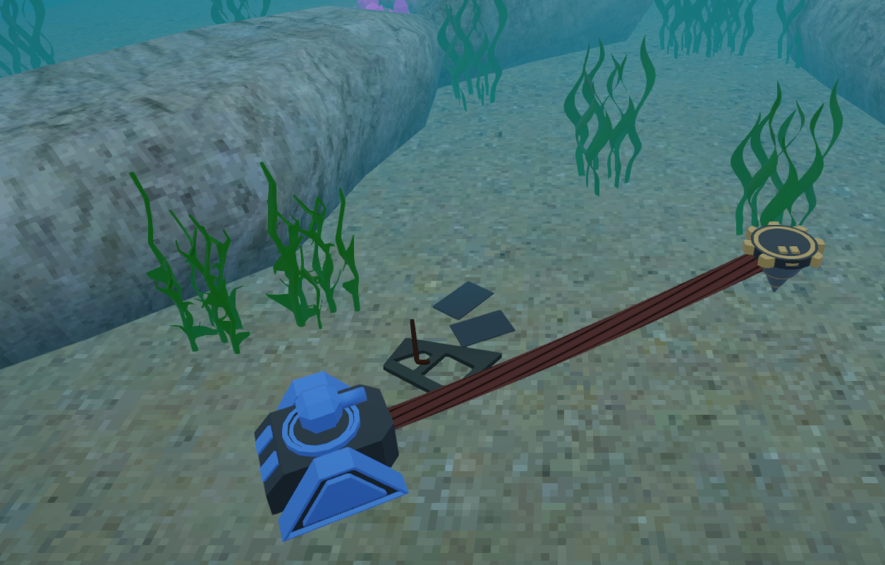

# Scavenge & Drill
*Scavenge the depths of the ocean for treasures*

A cooperative two-player 3D game made in Godot Engine for the [Multiplayer GameJam 2022](https://itch.io/jam/multiplayer).

This project uses a WebRTC connection established by a Nakama signaling server for P2P multiplayer.

## Credits
Nitai Heeb (OrangeJam) - Design, Programming, Modeling

Nils Wallenfang (nilolo) - Design, Programming

Niels Asselborn (ni3lz) - Modeling, 2D art

Paul Shelley  - Sound Effects

Lightspeed6 - Music

## License
Our code is licensed under MIT. Our sound, music, 2D and 3D graphical assets are licensed under CC-BY

Please respect the license of third-party assets that are part of this project.

## Third-party Assets

See CREDITS.md for the creators of icons and a texture used in this project.

This repo contains code from the add-ons [godot-nakama-webrtc](https://gitlab.com/snopek-games/godot-nakama-webrtc) by dsnopek and [Multirun](https://github.com/perfoon/Multirun) by perfoon, both MIT-licensed.